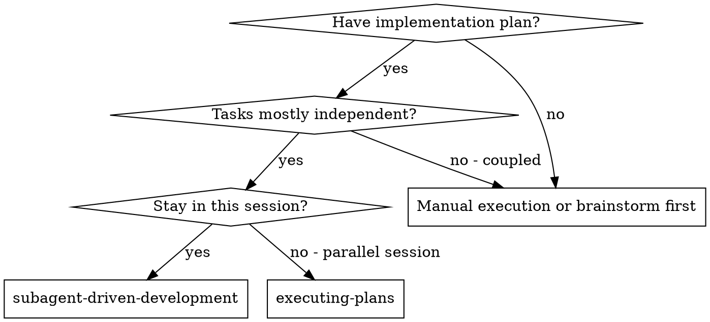
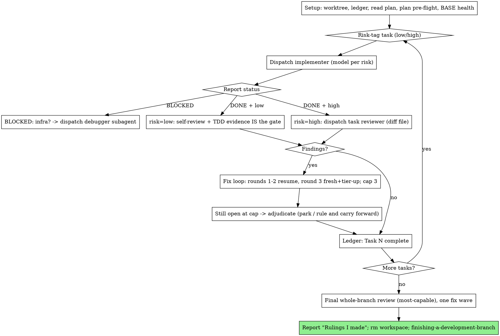

# SDD v2 — Workflow Diagrams

Explanatory. The contracts in SKILL.md govern execution.

## When to use

```dot
digraph when_to_use {
    "Have implementation plan?" [shape=diamond];
    "Tasks mostly independent?" [shape=diamond];
    "Stay in this session?" [shape=diamond];
    "subagent-driven-development" [shape=box];
    "executing-plans" [shape=box];
    "Manual execution or brainstorm first" [shape=box];

    "Have implementation plan?" -> "Tasks mostly independent?" [label="yes"];
    "Have implementation plan?" -> "Manual execution or brainstorm first" [label="no"];
    "Tasks mostly independent?" -> "Stay in this session?" [label="yes"];
    "Tasks mostly independent?" -> "Manual execution or brainstorm first" [label="no - coupled"];
    "Stay in this session?" -> "subagent-driven-development" [label="yes"];
    "Stay in this session?" -> "executing-plans" [label="no - parallel session"];
}
```

## Per-task loop (v2)

```dot
digraph process {
    rankdir=TB;
    "Setup: worktree, ledger, read plan, plan pre-flight, BASE health" [shape=box];
    "Risk-tag task (low/high)" [shape=diamond];
    "Dispatch implementer (model per risk)" [shape=box];
    "Report status" [shape=diamond];
    "BLOCKED: infra? -> dispatch debugger subagent" [shape=box];
    "risk=low: self-review + TDD evidence IS the gate" [shape=box];
    "risk=high: dispatch task reviewer (diff file)" [shape=box];
    "Findings?" [shape=diamond];
    "Fix loop: rounds 1-2 resume, round 3 fresh+tier-up; cap 3" [shape=box];
    "Still open at cap -> adjudicate (park / rule and carry forward)" [shape=box];
    "Ledger: Task N complete" [shape=box];
    "More tasks?" [shape=diamond];
    "Final whole-branch review (most-capable), one fix wave" [shape=box];
    "Report \"Rulings I made\"; rm workspace; finishing-a-development-branch" [shape=box style=filled fillcolor=lightgreen];

    "Setup: worktree, ledger, read plan, plan pre-flight, BASE health" -> "Risk-tag task (low/high)";
    "Risk-tag task (low/high)" -> "Dispatch implementer (model per risk)";
    "Dispatch implementer (model per risk)" -> "Report status";
    "Report status" -> "BLOCKED: infra? -> dispatch debugger subagent" [label="BLOCKED"];
    "Report status" -> "risk=low: self-review + TDD evidence IS the gate" [label="DONE + low"];
    "Report status" -> "risk=high: dispatch task reviewer (diff file)" [label="DONE + high"];
    "risk=low: self-review + TDD evidence IS the gate" -> "Findings?";
    "risk=high: dispatch task reviewer (diff file)" -> "Findings?";
    "Findings?" -> "Fix loop: rounds 1-2 resume, round 3 fresh+tier-up; cap 3" [label="yes"];
    "Findings?" -> "Ledger: Task N complete" [label="no"];
    "Fix loop: rounds 1-2 resume, round 3 fresh+tier-up; cap 3" -> "Still open at cap -> adjudicate (park / rule and carry forward)";
    "Still open at cap -> adjudicate (park / rule and carry forward)" -> "Ledger: Task N complete";
    "Ledger: Task N complete" -> "More tasks?";
    "More tasks?" -> "Risk-tag task (low/high)" [label="yes"];
    "More tasks?" -> "Final whole-branch review (most-capable), one fix wave" [label="no"];
    "Final whole-branch review (most-capable), one fix wave" -> "Report \"Rulings I made\"; rm workspace; finishing-a-development-branch";
}
```
